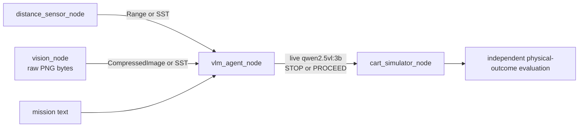

# Intelligent and Safe CPS (ISCPS) Project Lab: Securing Embodied Agent Using Authentication

> This template repository is a project for the combined course of
> [CSE 494](https://catalog.apps.asu.edu/catalog/classes/classlist?keywords=85268&searchType=all&term=2267)
> and [CSE 598](https://catalog.apps.asu.edu/catalog/classes/classlist?keywords=87933&searchType=all&term=2267),
> "Topic: Intelligent and Safe Cyber-Physical Systems" (ISCPS in short),
> at Arizona State University (ASU).
> If you have any questions about this project, please get in touch with the
> instructor, [Hokeun Kim](https://hokeun.github.io/), via
> [hokeun@asu.edu](mailto:hokeun@asu.edu).

A simulated warehouse cart is driven by a live vision-language model. The model
receives a camera image, a natural-language mission, and a reported obstacle
distance, then selects `STOP` or `PROCEED`. You will impersonate a ROS 2
publisher to make the model choose an unsafe action, then use the Secure Swarm
Toolkit (SST) to authenticate the legitimate distance and camera sources before
their data reaches the model. ASU's
[Sol supercomputer](https://docs.rc.asu.edu/about) is the default platform.



The model selects the action, the cart executes it, and the evaluator judges the
simulated physical outcome using the actual simulated distance. The evaluator
never overrides the model.

## Create your private repository

Before you begin the technical work:

1. Open this GitHub template repository.
2. Select **Use this template**.
3. Select **Create a new repository**.
4. Create the repository under your group's GitHub account.
5. Choose a clear repository name, for example `group05-embodied-agent-auth`.
6. Set the visibility to **Private**.
7. Do not publish course work in a public repository.
8. Add only your project partners as collaborators.
9. Clone your new private repository, not this template repository.
10. Do all group work and commits in that private repository.

One private repository per group keeps your work separate from the shared
starter and gives every partner the same code. For example:

```bash
git clone --recurse-submodules git@github.com:<OWNER>/<PRIVATE_REPOSITORY>.git
cd <PRIVATE_REPOSITORY>
git submodule update --init third_party/iotauth
```

## Run on ASU Sol

Sol is the default platform. Login nodes are for cloning, editing, and
submitting jobs. **Never run Ollama, VLM inference, ROS nodes, Auth, the
container build, or `make` targets with substantial computation on a
`sol-login*` host.** The run scripts refuse to start there.

### 1. Login node: clone and prepare

```bash
cd /scratch/$USER
git clone --recurse-submodules git@github.com:<OWNER>/<PRIVATE_REPOSITORY>.git
cd <PRIVATE_REPOSITORY>
git submodule update --init third_party/iotauth
make help
```

Use the login node only for lightweight work such as editing, Git commands,
`make help`, and Slurm job submission.

### 2. CPU allocation: build the container image

```bash
interactive -A class_cse494598fall2026 -p public -q class -t 60 -c 4 --mem=16G
module load apptainer/1.4.5 squashfs-4.6.1-gcc-11.2.0
cd /scratch/$USER/<PRIVATE_REPOSITORY>
apptainer build /scratch/$USER/embodied-agent-auth.sif containers/Apptainer.def
```

If your instructor provides a prebuilt SIF, use that path instead and skip the
build. Exit the CPU allocation when the image exists.

### 3. GPU allocation: start Ollama and the model

The model, ROS nodes, and Auth all use `127.0.0.1`, so Ollama must run on the
same allocated node as the experiments.

```bash
interactive -A class_cse494598fall2026 -p public -q class -t 240 -c 8 --mem=32G \
    -G a100.20gb:1
module load apptainer/1.4.5 ollama/0.30.3
cd /scratch/$USER/<PRIVATE_REPOSITORY>

export OLLAMA_MODELS=/scratch/$USER/ollama-models
export OLLAMA_HOST=http://127.0.0.1:11434
export VLM_MODEL=qwen2.5vl:3b
export VLM_TIMEOUT_S=90
mkdir -p "$OLLAMA_MODELS"

ollama serve > /scratch/$USER/ollama-serve.log 2>&1 &
OLLAMA_PID=$!
trap 'kill "$OLLAMA_PID" 2>/dev/null || true' EXIT
curl "$OLLAMA_HOST/api/version"
```

Wait for `/api/version` to answer before continuing. Then download the model
once. This is the only command in the whole project that downloads a model:

```bash
make model-setup
```

If your instructor provides a course Ollama endpoint instead, skip `ollama
serve` and `make model-setup`, and set `OLLAMA_HOST` to that endpoint.

### 4. GPU allocation: set up and check the project

Define one helper so every command runs inside the image:

```bash
export SIF=/scratch/$USER/embodied-agent-auth.sif
export APPTAINERENV_OLLAMA_HOST="$OLLAMA_HOST"
export APPTAINERENV_VLM_MODEL="$VLM_MODEL"
export APPTAINERENV_VLM_TIMEOUT_S="$VLM_TIMEOUT_S"
export ROS_AUTOMATIC_DISCOVERY_RANGE=LOCALHOST
export ROS_DOMAIN_ID=$((1 + SLURM_JOB_ID % 101))
export APPTAINERENV_ROS_AUTOMATIC_DISCOVERY_RANGE="$ROS_AUTOMATIC_DISCOVERY_RANGE"
export APPTAINERENV_ROS_DOMAIN_ID="$ROS_DOMAIN_ID"
lab() { apptainer exec --pwd "$PWD" "$SIF" "$@"; }

lab make setup
lab make doctor
lab make build
lab make test-offline
lab make vlm-check
```

`lab make setup` creates `.venv` and installs SST directly from
`third_party/iotauth/entity/python`. `lab make vlm-check` must pass before any
graded run.

### 5. GPU allocation: run the experiments

```bash
lab make baseline
lab make attack FALSE_DISTANCE=6.0
lab make attack-sweep REPETITIONS=3

lab make build-auth
lab make generate
lab make secure
lab make secure-attack

# CSE 598 only
lab make grad-vision-attack
lab make grad-vision-secure
```

Use the tested same-allocation procedure in
[ROS graph capture](ASSIGNMENT.md#ros-graph-capture) to capture the baseline and
attack graphs before each scenario exits.

As a batch alternative, the default job runs only the common CSE 494/598
experiment commands. Complete the ROS graph captures interactively as described
above.

```bash
sbatch slurm/run_experiments.sbatch
```

CSE 598 groups explicitly enable Part 5:

```bash
sbatch --export=ALL,RUN_GRAD_EXTENSION=1 \
    slurm/run_experiments.sbatch
```

Part 5 results go in the same final ZIP. No second Canvas upload is required.

### 6. Clean up and submit

```bash
lab make auth-stop
lab python3 scripts/check_cleanup.py

cp submission/answers_template.md submission/answers.md
# Fill in submission/answers.md before continuing.
lab make submission GROUPID=<groupid>
unzip -l submission/group<groupid>_embodied-agent-auth.zip
```

Create and inspect the ZIP before running `lab make clean`. Cleaning deletes
the generated results, so the same submission cannot be rebuilt afterward
unless the experiments are rerun.

Copy the ZIP to your machine and upload it to Canvas:

```bash
scp <asurite>@sol.asu.edu:/scratch/<asurite>/<PRIVATE_REPOSITORY>/submission/group<groupid>_embodied-agent-auth.zip .
```

Read [ASSIGNMENT.md](ASSIGNMENT.md) for the graded parts, required repetitions,
deliverables, and rubric. [docs/SETUP.md](docs/SETUP.md) has the detailed
environment reference, including which steps must be repeated in each new
allocation.

## Optional: run on your own Linux machine

Ubuntu 24.04 with ROS 2 Jazzy and Python 3.10 through 3.12 is supported. WSL2
works as a Linux environment. You need a local GPU-backed Ollama server or a
reachable course endpoint.

```bash
sudo apt install -y git make openjdk-17-jdk maven nodejs npm openssl
git submodule update --init third_party/iotauth
source /opt/ros/jazzy/setup.bash
make setup && make doctor && make build && make vlm-check
```

See [docs/SETUP.md](docs/SETUP.md) for the Docker alternative. Local timing will
differ from Sol because inference latency depends on the machine.

## Command reference

Use `make help` to list the available targets. On Sol, run project targets that
use Python, ROS 2, SST, or the VLM as `lab make <target>` after defining `lab`
in the setup instructions. On a personal Linux machine, omit the `lab` prefix.

Follow [ASSIGNMENT.md](ASSIGNMENT.md) for the required command order,
repetitions, and CSE 598 extension. Run `make model-setup` directly on the GPU
compute node after loading the Ollama module. Do not run `lab make clean` until
you have created and inspected the submission ZIP because it deletes the
generated results.

## Documentation

- [ASSIGNMENT.md](ASSIGNMENT.md): graded parts, deliverables, rubric, and
  submission
- [docs/SETUP.md](docs/SETUP.md): Sol, workstation, and Docker environment
  reference
- [docs/DESIGN.md](docs/DESIGN.md): VLM, ROS, SST, logging, and evaluation
  design
- [SECURITY.md](SECURITY.md): threat model, security scope, and responsible use
- [submission/answers_template.md](submission/answers_template.md): report
  template

## License

BSD 2-Clause. See [LICENSE](LICENSE) and
[THIRD_PARTY_NOTICES.md](THIRD_PARTY_NOTICES.md) for third-party attribution,
including the Secure Swarm Toolkit pinned at `third_party/iotauth`.
