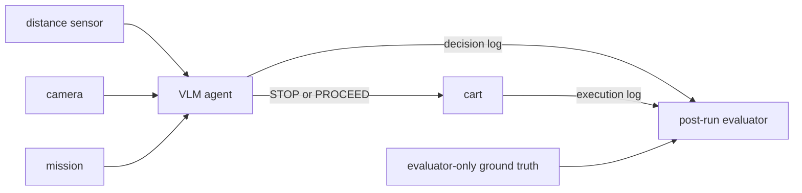

# Embodied AI Lab: Securing an Embodied Agent with Authentication

A live `qwen2.5vl:3b` vision-language model receives a camera image, a mission,
and a reported obstacle distance, then selects `STOP` or `PROCEED` for a
simulated warehouse cart. You will impersonate ROS 2 sensor publishers and use
the Secure Swarm Toolkit (SST) to authenticate legitimate sources.



The cart receives only the VLM action. After ROS stops, a separate evaluator
uses ground truth to judge the recorded execution. Ground truth never reaches
the VLM or cart.

## How the lab is structured

The project has one flat ROS package in `ros2_ws/src/lab/` and one launch file.
`vlm.py` contains the VLM client, decision flow, and ROS agent node;
`validation.py` contains the shared schemas and input checks. The independent
ground-truth evaluator stays outside the ROS package in
`scripts/evaluate_run.py` so it cannot become part of the cart's runtime path.
The Make targets select one of seven modes: `baseline`, `attack`, `secure`,
`secure-attack`, `grad-vision-baseline`, `grad-vision-attack`, or
`grad-vision-secure`. Use the Make targets below instead of invoking the launch
file directly.

The ROS-only modes use the default ROS 2 configuration, without DDS Security.
A replacement publisher can copy a node name, topic, message type, QoS, and
frame ID, but those ROS discovery attributes do not authenticate its source.
`ROS_DOMAIN_ID` and localhost discovery reduce accidental interference; they
are not security boundaries.

In protected modes, SST authenticates registered distance and camera sources
and protects message confidentiality and integrity. An unregistered-source
attack targeting SST-protected nodes cannot deliver an authenticated sensor
message. SST does not prove that an authenticated sensor reports physical
truth or that a VLM action is safe.

The agent fails closed with `STOP` for missing, stale, malformed,
undecodable, or unauthenticated input, endpoint failure or timeout, and invalid
model output. It publishes each schema-valid model action unchanged; there is
no hand-written driving rule between the VLM and cart.

Each run writes a directory under `results/` containing the sensor, VLM, cart,
terminal, evaluation, and summary evidence. In particular,
`cart_simulator.jsonl` records only execution, while `evaluation.jsonl` and
`summary.json` contain the independent post-run outcome. The reported-distance
sweep additionally creates `trials.csv` and `sweep.png`.

## Start in a private repository and clone it on ASU Sol

Create one **private** repository per group from this template and add only your
partners, then on ASU Sol, clone that private copy and update the SST submodule:

```bash
cd /scratch/$USER
git clone git@github.com:<OWNER>/<PRIVATE_REPOSITORY>.git
cd <PRIVATE_REPOSITORY>
git submodule update --init third_party/iotauth
```

Do not publish coursework in a public repository.

## Run on ASU Sol

Login nodes are only for editing, Git, and Slurm submission. Never run a
container build, Ollama, model inference, ROS nodes, Auth, or compute-heavy
`make` targets on `sol-login*`.

The repository, SIF, staged model, `.venv`, and ROS build can persist between
allocations while their files remain under `/scratch`. The allocation, loaded
modules, Ollama process, environment variables, and `lab` function must be
created again in every new allocation. `/scratch` is temporary and not backed
up, so keep source changes in the group's private repository.

### 1. Build the container in a CPU allocation

```bash
interactive -A class_cse494598fall2026 -p public -q class -t 60 -c 4 --mem=16G
module load apptainer/1.4.5 squashfs-4.6.1-gcc-11.2.0
cd /scratch/$USER/<PRIVATE_REPOSITORY>
apptainer build /scratch/$USER/embodied-agent-auth.sif containers/Apptainer.def
```

Use an instructor-provided SIF if available. Exit the allocation when the image
exists.

### 2. Start Ollama in a GPU allocation

Ollama and the experiment use loopback, so they must run on the same node.

```bash
interactive -A class_cse494598fall2026 -p htc -q class -t 240 -c 8 --mem=32G \
    --gres=gpu:a100.20gb=1
module load apptainer/1.4.5 ollama/0.30.3
cd /scratch/$USER/<PRIVATE_REPOSITORY>

export OLLAMA_MODELS=/scratch/$USER/ollama-models
export OLLAMA_HOST=http://127.0.0.1:11434
export VLM_MODEL=qwen2.5vl:3b
export VLM_TIMEOUT_S=90
mkdir -p "$OLLAMA_MODELS"

ollama serve > /scratch/$USER/ollama-serve.log 2>&1 &
OLLAMA_PID=$!
trap 'kill "$OLLAMA_PID" 2>/dev/null || true' EXIT
curl "$OLLAMA_HOST/api/version"
```

Wait for the version endpoint. Download the model once on the compute node:

```bash
make model-setup
```

If the course provides an Ollama endpoint, skip the server and download and set
`OLLAMA_HOST` to that endpoint.

### 3. Define the `lab` wrapper

Run every other project command inside the container:

```bash
export SIF=/scratch/$USER/embodied-agent-auth.sif
export ROS_AUTOMATIC_DISCOVERY_RANGE=LOCALHOST
export ROS_DOMAIN_ID=$((1 + SLURM_JOB_ID % 101))
export APPTAINERENV_OLLAMA_HOST="$OLLAMA_HOST"
export APPTAINERENV_VLM_MODEL="$VLM_MODEL"
export APPTAINERENV_VLM_TIMEOUT_S="$VLM_TIMEOUT_S"
export APPTAINERENV_ROS_AUTOMATIC_DISCOVERY_RANGE="$ROS_AUTOMATIC_DISCOVERY_RANGE"
export APPTAINERENV_ROS_DOMAIN_ID="$ROS_DOMAIN_ID"
lab() { apptainer exec --pwd "$PWD" "$SIF" "$@"; }

lab make setup
lab make doctor
lab make build
lab make test-offline
lab make vlm-check
```

> Note and Troubleshooting: If you see `Live vision + structured-output check passed.`
> at the end of the standard output, all checks are successful. However, if you see
> a message like `ERROR [timeout]: Ollama did not answer within 90.0s`, that indicates
> the last command, `lab make vlm-check`, was not successful, potentially due to a
> transient error. We recommend running `lab make vlm-check` again after a while.

### 4. Run the experiments

```bash
lab make baseline
lab make attack FALSE_DISTANCE=6.0
lab make attack-sweep REPETITIONS=3

lab make build-auth
lab make generate
lab make secure
lab make secure-attack

# CSE 598 only
lab make grad-vision-baseline
lab make grad-vision-attack
lab make grad-vision-secure
```

Each scenario stops ROS before evaluating itself. Capture the baseline and
attack ROS graphs with the same-allocation, same-domain procedure in
[ASSIGNMENT.md](ASSIGNMENT.md#ros-graph-capture).

The batch alternative runs the common experiments. CSE 598 groups enable the
extension explicitly:

```bash
sbatch slurm/run_experiments.sbatch
sbatch --export=ALL,RUN_GRAD_EXTENSION=1 slurm/run_experiments.sbatch
```

Graph captures still require the interactive procedure.

### 5. Submit before cleaning

```bash
lab make auth-stop
lab python3 scripts/check_cleanup.py
lab python3 scripts/check_ros_cleanup.py

cp submission/answers_template.md submission/answers.md
# Fill in submission/answers.md, then:
lab make submission GROUPID=<groupid>
unzip -l submission/group<groupid>_embodied-agent-auth.zip

# Only after inspecting the ZIP:
lab make clean
```

Cleaning deletes generated results. Copy the ZIP to your computer and upload it
to Canvas:

```bash
scp <asurite>@sol.asu.edu:/scratch/<asurite>/<PRIVATE_REPOSITORY>/submission/group<groupid>_embodied-agent-auth.zip .
```

## References

- [ASSIGNMENT.md](ASSIGNMENT.md): tasks, evidence, rubric, and graph capture
- [SECURITY.md](SECURITY.md): authorized use and threat model

Run `make help` for the command list. On Ubuntu 24.04 with ROS 2 Jazzy and
Python 3.10-3.12, initialize `third_party/iotauth`, source
`/opt/ros/jazzy/setup.bash`, and run the same Make targets without the `lab`
prefix. Use a local GPU-backed Ollama server or a course-provided endpoint;
local inference timing can differ from Sol.

BSD 2-Clause. See [LICENSE](LICENSE) and
[THIRD_PARTY_NOTICES.md](THIRD_PARTY_NOTICES.md).
