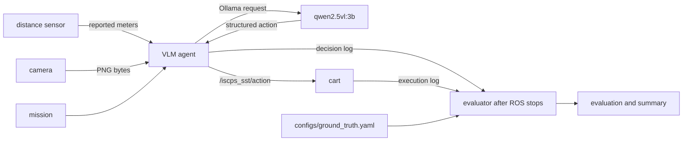

# System design

## Decision and evaluation boundaries



The agent publishes every schema-valid model action unchanged. The cart
subscribes only to `/iscps_sst/action`, executes `STOP` or `PROCEED`, and logs
`action_executed`. It never loads the scenario or ground truth and never judges
safety.

After ROS stops, `scripts/evaluate_run.py` reads the agent and cart logs plus
evaluator-only `configs/ground_truth.yaml`. It writes `evaluation.jsonl` and
the run summaries. Evaluation can classify an action but cannot influence it;
there is no outcome topic or evaluator-to-cart path.

## Repository and modes

The single ROS package has flat Python sources:

```text
ros2_ws/src/lab/
├── *.py
├── launch/lab.launch.py
├── package.xml
├── setup.cfg
└── setup.py
```

All scenarios use `ros2 launch lab lab.launch.py mode:=<mode>`. Use the Make
targets rather than invoking launch directly. The seven modes are `baseline`,
`attack`, `secure`, `secure-attack`, `grad-vision-baseline`,
`grad-vision-attack`, and `grad-vision-secure`.

`scripts/run_scenario.sh` starts the selected graph, waits for the cart's
execution event, stops ROS, and then runs the evaluator.

## Inputs and authentication

| Component | ROS-only | SST-protected |
|---|---|---|
| distance sensor | `sensor_msgs/msg/Range` | `SecureSourceServer` JSON |
| camera | `sensor_msgs/msg/CompressedImage` | `SecureSourceServer` bytes |
| VLM agent | ROS subscribers | one `SecureInputClient` per source |
| cart | executes only the action topic | identical behavior |

DDS Security and SROS2 are intentionally disabled. A replacement publisher can
copy the legitimate node name, topic, type, QoS, and frame ID; those discovery
attributes do not authenticate its identity. `ROS_DOMAIN_ID` and localhost
discovery reduce accidental interference but are not security boundaries.

SST uses fixed loopback endpoints from `configs/sst.yaml`:

| Source | Endpoint | Auth group |
|---|---|---|
| distance | `127.0.0.1:22101` | `DistanceSensors` |
| camera | `127.0.0.1:22102` | `VisionSensors` |

Malicious sources are absent from `sst/configs/warehouse_cart.graph` and have
no credentials. They may bind a port but cannot complete the SST handshake or
deliver an authenticated message. SST authenticates registered entities and
protects confidentiality and integrity; it does not prove that an authenticated
sensor reports physical truth or that a VLM action is safe.

## VLM and fail-closed behavior

The model response contains the two supplied distances, distance assessment,
signal, path assessment, `STOP` or `PROCEED`, and a short reason. `make
vlm-check` verifies the endpoint, model tag, vision input, and structured
response before graded runs.

The agent emits fail-closed `STOP` for missing, stale, malformed, undecodable,
or unauthenticated input, endpoint failure or timeout, and invalid model output.
These checks handle invalid execution; they do not replace a valid VLM action
with a hand-written driving rule. A required-inference failure makes the run
invalid.

## Evidence

Each scenario writes `results/<mode>-<timestamp>-<id>/` with:

- `manifest.json` and sensor/agent logs;
- `vlm_agent.jsonl`: model response, latency, authentication, decision ID, and
  selected action;
- `cart_simulator.jsonl`: matching decision ID and `action_executed`, with no
  ground truth or safety judgment;
- `terminal.log`: launch output;
- `evaluation.jsonl`: post-ROS physical outcome and evaluated truth; and
- `summary.json` and `summary.csv`: correlated run evidence.

The sweep additionally writes `trials.csv`, aggregate `summary.json`, and
`sweep.png`. The submission builder includes required evidence and editable
student sources but excludes `runtime/`, which holds generated SST state.

The VLM emits one high-level action, not a motor trajectory. Trajectory safety,
actuator authorization, compromised hosts, and truthful-but-misleading data are
outside this lab's protection claim.
