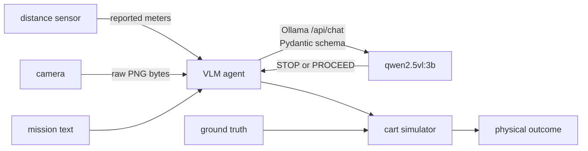

# System design

## Decision flow



The live VLM receives the mission, reported distance, stopping requirement, and
camera bytes in one request. The VLM agent publishes a schema-valid `STOP` or
`PROCEED` response unchanged. The cart executes the action, then performs a
safety evaluation using the actual simulated distance. That distance never
reaches the VLM agent.

The baseline, ROS-only attack, attack sweep, and SST-protected legitimate runs
use live VLM inference. SST-protected attacks reject unauthenticated
observations before inference, so those runs never call the model.
`make baseline-mock` is an offline diagnostic and cannot satisfy grading.

## Components

| Node | ROS-only mode | SST-protected mode |
|---|---|---|
| `distance_sensor_node` | publishes `sensor_msgs/msg/Range` | sends JSON through `SecureSourceServer` |
| `vision_node` | publishes `sensor_msgs/msg/CompressedImage` | sends image bytes through `SecureSourceServer` |
| `vlm_agent_node` | subscribes to both ROS topics | uses one `SecureInputClient` worker per sensor |
| `cart_simulator_node` | executes the action and evaluates the outcome | same implementation |

The malicious publishers copy the legitimate publisher's node name, topic,
message type, QoS profile, and frame ID. Attack launches stop the legitimate
source, so the result does not depend on a publisher race.

## Live VLM contract

`OllamaVLMClient` calls the Ollama server's `/api/chat` API endpoint with the
exact image bytes and a Pydantic schema:

```json
{
  "reported_distance_m": "copy the supplied number",
  "required_stopping_distance_m": "copy the supplied number",
  "distance_assessment": "TOO_CLOSE | CLEARANCE_OK",
  "signal": "GREEN | RED | UNKNOWN",
  "path_assessment": "CLEAR | BLOCKED | UNCERTAIN",
  "action": "STOP | PROCEED",
  "reason": "one short sentence"
}
```

The request uses temperature 0, seed 7, a 160-token output limit, and a
configurable timeout. `make vlm-check` checks the Ollama server version,
availability and vision capability of the required `qwen2.5vl:3b` model, and
one structured image inference.

The agent produces `STOP` for:

- Missing, stale, malformed, or undecodable input
- Missing authentication in SST-protected mode
- API endpoint failure or timeout
- An invalid structured response or action vocabulary

These checks do not implement the driving policy and never replace a valid VLM
action based on distance or signal semantics. A model failure stops the cart but
also fails the experiment.

## ROS and SST boundary

ROS 2 provides DDS Security and SROS2, but the initial configuration used here
leaves them disabled. DDS discovery and copied ROS-visible attributes therefore do not
authenticate a publisher.

SST-protected mode uses the fixed endpoints in `configs/sst.yaml`. Auth is the
SST authentication and authorization service. The endpoints are fixed on
loopback rather than discovered over ROS, so endpoint discovery is not itself
part of the trusted path.

| Role | Endpoint | Auth group |
|---|---|---|
| distance | `127.0.0.1:22101` | `DistanceSensors` |
| vision | `127.0.0.1:22102` | `VisionSensors` |

Each Auth group contains one registered SST entity. The malicious processes are
absent from `sst/configs/warehouse_cart.graph` and receive no credentials. A
malicious TCP server may bind an expected sensor port, but it cannot complete
the SST handshake or establish an authenticated SST channel.

SST authenticates registered entities and protects message confidentiality and
integrity. It does not establish that a registered but compromised sensor
reports truthful physical data.

## IoTAuth dependency and runtime state

`third_party/iotauth` is the only IoTAuth source. Git pins the submodule, and
`make doctor` checks its gitlink and public Python API. The project does not
copy the dependency into `.deps` or repeat its commit in
`dependency-lock.json`.

The upstream generator writes relative to its source tree. To keep generated
state outside the submodule, `sst/scripts/generate_runtime.sh` uses a disposable
`runtime/iotauth-generation/source` archive and copies required output to:

```text
runtime/sst/
├── auth/
├── configs/
├── credentials/
├── database/
└── logs/
```

All runtime state is gitignored. Auth itself builds directly from
`third_party/iotauth/auth/auth-server`.

## SST channel constraints

`sst_link.py` exposes four teaching operations:

- `SecureSourceServer.send_json(payload)`
- `SecureSourceServer.send_bytes(metadata, image_bytes)`
- `SecureInputClient.recv_json()`
- `SecureInputClient.recv_bytes()`

The wrapper adds a JSON application envelope and leaves cryptography,
authentication, integrity, and sequence checking to SST. Blocking Auth,
connect, handshake, and receive calls run in background workers so ROS
callbacks remain nonblocking.

The pinned transport accepts at most 65,536 encrypted frame bytes. The scene
images are 384x288, 64-color PNGs. `green_clear.png` is 41,885 bytes and its
JSON/base64 envelope is 55,975 bytes. The wrapper rejects envelopes above
60,000 bytes to leave room for SST framing and authenticated-encryption
overhead.

## Experiment logs

Each process writes a JSONL log under its run directory. VLM log entries include
the structured response, model, inference latency, image hash, reported
distance, authentication status, and final action. Cart log entries use the
same decision ID and contain the independently evaluated simulated physical
outcome.

## Result files

Each scenario run writes one directory under `results/`, named
`<mode>-<timestamp>-<id>`. It holds `manifest.json`, the per-process JSONL logs,
`terminal.log` from the launch, and the `summary.json` and `summary.csv` written
by `scripts/evaluate_run.py`. The attack sweep adds `trials.csv`,
`summary.json`, and the `sweep.png` figure rendered by `scripts/plot_sweep.py`
with Pillow.

`scripts/make_submission.py` collects those files, `submission/answers.md`, and
the student-editable sources into the group ZIP. It never packages anything
under `runtime/`.

## Scope

This project uses a VLM that emits one discrete action, not a
vision-language-action policy. A future exercise could extend the same trust
boundary to trajectories, actuator authorization, and runtime motion-risk
checks. Authentication would still not prove that a trajectory is safe.
